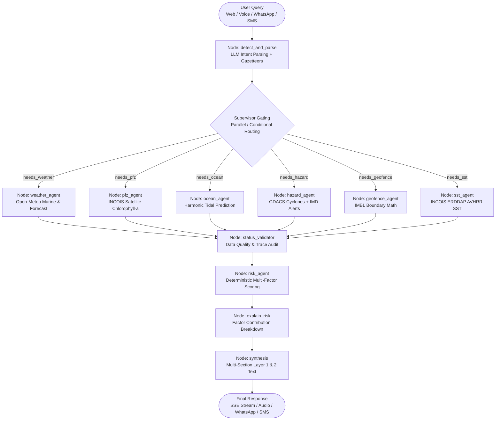

# 🌊 Tarang (तरंग) — Marine Intelligence & Decision-Support Platform

<div align="center">


[](https://fastapi.tiangolo.com)
[](https://langchain-ai.github.io/langgraph/)
[-black?style=flat-square&logo=next.js&logoColor=white)](https://nextjs.org/)
[](https://www.python.org/)
[](https://www.typescriptlang.org/)
[](https://leafletjs.com/)

**AI-powered, deterministic coastal decision-support and fisheries navigation platform for India's 7,516 km coastline.**

*Empowering artisanal and small-scale fishermen with real-time marine weather, satellite fishing zones (PFZ), tidal forecasts, maritime border breach alerts (IMBL), deterministic safe route planning, and multilingual voice assistance across 9 Indian coastal languages.*

</div>

---

## 📑 Table of Contents

- [Overview & The Problem We Solve](#-overview--the-problem-we-solve)
- [Key Features & Capabilities](#-key-features--capabilities)
- [System Architecture & Agent Topology](#-system-architecture--agent-topology)
- [Specialist Agents & Nodes](#-specialist-agents--nodes)
- [Safe Marine Route Optimization Engine](#-safe-marine-route-optimization-engine)
- [Multi-Intent Query Processing](#-multi-intent-query-processing)
- [Maritime Border Monitoring & Breach Alerting](#-maritime-border-monitoring--breach-alerting)
- [Multilingual Coastal Engine & Speech](#-multilingual-coastal-engine--speech)
- [Live Data Sources & Provenance](#-live-data-sources--provenance)
- [API Reference](#-api-reference)
- [Project Directory Structure](#-project-directory-structure)
- [Getting Started & Local Setup](#-getting-started--local-setup)
- [Environment Configuration](#-environment-configuration)
- [Testing & Validation](#-testing--validation)
- [Production Deployment](#-production-deployment)
- [Safety & Ethical Principles](#-safety--ethical-principles)

---

## 🎯 Overview & The Problem We Solve

Over **4 million artisanal and small-scale fishermen** across India's coastline venture into the sea daily in non-motorized and motorized craft under 20 meters. They face four life-threatening and livelihood-critical challenges:

1. **Complex, Inaccessible Weather Warnings**: Bulletins from INCOIS, IMD, and international agencies are dense, PDF-bound, English-heavy, and full of oceanographic jargon unintelligible to traditional fishermen.
2. **Accidental Maritime Border Crossing (IMBL)**: In narrow channels like the Palk Strait and Gulf of Mannar, small fishing boats inadvertently drift across the International Maritime Boundary Line (IMBL), leading to boat seizures, prolonged detentions, and diplomatic conflict.
3. **Wasted Fuel Searching for Fish**: Traditional fishers rely on generational intuition to locate fishing grounds. Without spatial guidance for Potential Fishing Zones (PFZ), boats consume scarce kerosene and diesel fruitlessly.
4. **Dangerous Marine Navigation**: Existing navigation tools are designed for cars or commercial container ships. Small craft lack marine route planning that accounts for departure times, wave heights, weather corridors, shallow bathymetry, and land avoidance.

### The Tarang Solution

Tarang bridges this gap by combining **real-time satellite observation**, **oceanographic forecasting**, **geospatial polygon constraint engines**, and **multi-agent LangGraph orchestration**. It reasons deterministically over physical conditions and delivers concise, life-saving answers in **9 Indian coastal languages** through Web, WhatsApp, SMS, and Voice.

---

## ✨ Key Features & Capabilities

### 🗺️ 1. Safe Marine Route Optimization Engine
- **Deterministic A\* Pathfinding**: Computes safe navigable routes over an 8-connected water grid covering Indian coastal waters.
- **Real Landmass Geometry Masking**: Sub-millisecond point-in-polygon land checks via Shapely prepared geometry and `india_landmass.geojson`. Routes can never cross land or dangerous shoals.
- **Departure Time & Dynamic Arrival Offsets**: Evaluates forecast weather (wave height, wind speed, gusts) along each route leg at the exact future hour the vessel will arrive.
- **Hard Safety Exclusion**: Strictly prunes candidate nodes on land, within 5 km of the IMBL, in severe seas ($\ge 4.0\text{ m}$), high winds ($\ge 90\text{ km/h}$), or active storm advisory zones.
- **PFZ Attraction Bonus**: Incorporates high-chlorophyll fishing zones as positive cost modifiers, steering fishermen toward productive waters safely.

### 🧠 2. Compound Multi-Intent Supervisor
- **Structured LLM Intent Parser**: Uses Groq (`openai/gpt-oss-20b` in JSON mode) to parse complex, multi-faceted queries (e.g. *"What is the sea level near me, where is the nearest fishing zone, any hazard, and what is the wind speed?"*).
- **Non-Exclusive Agent Routing**: Dynamically dispatches queries to all required agents (`weather_agent`, `ocean_agent`, `pfz_agent`, `hazard_agent`, `risk_agent`) without mutually exclusive drop-offs.
- **Multi-Section Dynamic Synthesis**: Synthesizes clean, comprehensive multi-section responses covering each asked topic with direct factual groundings and disclaimers.
- **Inland-to-Coastal Fallback**: Automatically redirects relative queries ("near me") tested from inland developer machines to the active coastal harbour selected on the map or session.

### 🛡️ 3. IMBL Geofencing & Real-Time Border Breach Alerts
- **Real-Time Distance & Bearing Math**: Computes great-circle distance (Haversine formula) to UNCLOS treaty boundary polylines (India–Sri Lanka, India–Pakistan, India–Bangladesh).
- **Multi-Tier Boundary Zones**:
  - `SAFE` ($> 15\text{ km}$ from border)
  - `WARNING` ($5\text{--}15\text{ km}$ from border)
  - `CRITICAL BREACH IMMINENT` ($< 5\text{ km}$ from border)
- **Automated Proactive Alerts**: Dispatches immediate WhatsApp and SMS alerts with emergency heading guidance (`safe_bearing_deg`) to steer back to Indian waters.

### 🗣️ 4. 9 Indian Coastal Languages & Voice Interface
- **Complete Coastal Language Coverage**:
  - English (`en`)
  - Hindi (`hi` — हिन्दी)
  - Tamil (`ta` — தமிழ்)
  - Gujarati (`gu` — ગુજરાતી)
  - Bengali (`bn` — বাংলা)
  - Telugu (`te` — తెలుగు)
  - Malayalam (`ml` — മലയാളം)
  - Marathi (`mr` — मराठी)
  - Odia (`od` — ଓଡ଼ିଆ)
- **Automatic Script Detection**: Detects Devanagari, Tamil, Bengali, Gujarati, Telugu, Malayalam, and Odia unicode blocks or honors manual UI overrides.
- **Sarvam AI Voice Synthesis**: Natural text-to-speech rendering of marine advisories in authentic regional accents.
- **Whisper Voice Transcription**: Speak queries directly in native language via browser microphone.

### 📊 5. Deterministic Risk Assessment (ORCA Engine)
- **Mathematical Safety Scoring**: No LLM hallucination for safety clearance. Calculates an objective composite risk score ($0\text{--}100$) based on weighted physical metrics:
  $$\text{Score} = 0.30 \times \text{Wave} + 0.20 \times \text{Wind} + 0.30 \times \text{Hazard} + 0.20 \times \text{Boundary}$$
- **Automatic Hazard Overrides**: Active tropical cyclones, severe weather warnings, or proximity within 5 km of international borders automatically force risk to `HIGH` or `EXTREME`.
- **Explainable "Why this risk?" Engine**: Transparent factor contribution breakdown detailing exactly which physical variable drove the safety rating.
- **Fail-Closed Architecture**: If critical data streams (weather or hazard) are offline, Tarang marks risk as `UNKNOWN` and refuses to authorize departure.

### 📱 6. Multi-Channel Accessibility
- **Modern Web Application**: Next.js 14 App Router, Leaflet interactive map, dynamic risk dial, real-time agent execution drawer, and marine details cards.
- **WhatsApp Bot**: Conversational querying via Twilio WhatsApp API with emoji badges and rich Markdown formatting.
- **SMS Alerts & Webhooks**: Offline cellular delivery (`/sms` and `/webhook/sms`) for low-bandwidth mobile handsets at sea.

---

## 🏗️ System Architecture & Agent Topology

Tarang is structured around an event-driven, deterministic **LangGraph StateGraph** orchestrated by FastAPI.



---

## 🤖 Specialist Agents & Nodes

| Agent / Node | Source File | Capability | Primary Source | Execution Trigger |
|---|---|---|---|---|
| **`detect_and_parse`** | [`detect_and_parse.py`](backend/graph/nodes/detect_and_parse.py) | Language detection (9 languages), multi-intent extraction, gazetteer coordinate resolution, temporal ISO window extraction | Groq `gpt-oss-20b`, Coastal Gazetteer, OSM Nominatim | Always (Initial Gate) |
| **`weather_agent`** | [`weather_agent.py`](backend/graph/nodes/weather_agent.py) | Significant wave height ($H_s$), wave direction, wind speed, wind gusts, atmospheric pressure (MSL), sea state | Open-Meteo Marine & Atmosphere | `needs_weather == True` |
| **`pfz_agent`** | [`pfz_agent.py`](backend/graph/nodes/pfz_agent.py) | Potential Fishing Zones extracted from chlorophyll-a gradients, zone distance (km), bearing, productivity indicators | INCOIS Oceansat-2 (ERDDAP) | `needs_pfz == True` |
| **`ocean_agent`** | [`ocean_agent.py`](backend/graph/nodes/ocean_agent.py) | Harmonic tidal prediction, current water level above Chart Datum (m), tidal phase (Flood/Ebb), next high/low tides in IST | INCOIS Tide Model / Survey of India | `needs_ocean == True` |
| **`hazard_agent`** | [`hazard_agent.py`](backend/graph/nodes/hazard_agent.py) | Tropical cyclone tracking within 500 km, wind gust warnings, squall alerts, severe marine advisories | GDACS, Open-Meteo Alerts, IMD Bulletins | `needs_hazard == True` |
| **`geofence_agent`** | [`geofence_agent.py`](backend/graph/nodes/geofence_agent.py) | Distance to International Maritime Boundary Lines (IMBL), foreign water penetration, emergency return bearing | UNCLOS Treaty Boundary Geometries | `needs_geofence == True` |
| **`sst_agent`** | [`sst_agent.py`](backend/graph/nodes/sst_agent.py) | Sea Surface Temperature (SST in °C) and thermal anomaly relative to baseline | NOAA AVHRR/AMSR on INCOIS ERDDAP | `needs_sst == True` |
| **`risk_agent`** | [`risk_agent.py`](backend/graph/nodes/risk_agent.py) | Deterministic mathematical composite risk scoring ($0\text{--}100$), safety thresholds, automatic hazard overrides | Specialist agent outputs | `needs_risk == True` |
| **`explain_risk`** | [`explain_risk.py`](backend/graph/nodes/explain_risk.py) | Detailed factor contribution points, percentage weights, and natural language explanation | Risk agent state | `query_type == "risk_explanation"` |
| **`status_validator`**| [`build_graph.py`](backend/graph/build_graph.py) | Evaluates execution status (`success`, `partial`, `failed`) and data freshness (`live`, `fallback`, `unavailable`) | All agent traces | Always |
| **`synthesis`** | [`synthesis.py`](backend/graph/nodes/synthesis.py) | Two-layer output generation: Layer 1 (conversational natural text) and Layer 2 (structured evidence cards & GeoJSON) | Groq `gpt-oss-120b` + Intent Template Fallback | Always (Terminal Gate) |

---

## ⚓ Safe Marine Route Optimization Engine

The Tarang Route Optimizer ([`route_planner.py`](backend/tools/route_planner.py)) solves coastal navigation for small fishing boats without relying on generative LLM path assumptions:

```
[Start Coordinates] ──► [Land Mask Filter] ──► [A* Water Graph Search] ──► [Dynamic Arrival Offsets] ──► [Safe Route Output]
         ▲                     ▲                          ▲                          ▲
         │                     │                          │                          │
[End Coordinates]    [india_landmass.geojson]     [IMBL Constraint Buffer]    [Weather & PFZ Corridor Sampling]
```

### Key Technical Pillars:
1. **Shapely Prepared Land Polygon (`land_mask.py`)**:
   - Ingests `india_landmass.geojson`, a validated polygon covering the Indian subcontinent and Sri Lankan coastlines.
   - Evaluates point coordinates in $< 1\text{ ms}$ using prepared geometry binary predicates.
   - Automatically drops any candidate waypoint that intersects mainland, islands, or sandbanks.
2. **Hard Safety Constraints**:
   - Nodes within 5 km of the IMBL are strictly pruned from graph expansion.
   - Any leg encountering wave height $\ge 4.0\text{ m}$ or wind $\ge 90\text{ km/h}$ is severed.
3. **Corridor Environmental Sampling**:
   - Rather than making hundreds of slow external API requests per grid node, Tarang samples weather conditions at key corridor anchor points (departure, midpoint, arrival) with arrival time offsets.
   - Reduces route planning execution latency from $> 60\text{ seconds}$ to **$\approx 3\text{--}4\text{ seconds}$**.
4. **Potential Fishing Zone Attraction**:
   - Cost function:
     $$\text{Cost}(u, v) = \text{Distance}(u, v) + (w_{\text{risk}} \times \text{RiskScore}) - (w_{\text{pfz}} \times \text{ChlorophyllBonus})$$
   - Steers vessels safely closer to productive feeding zones when enabled.

---

## 🧩 Multi-Intent Query Processing

Traditional chatbots fail when fishermen combine several questions into one breath. Tarang solves this through a dual-stage pipeline:

1. **LLM Capability Extraction ([`detect_and_parse.py`](backend/graph/nodes/detect_and_parse.py))**:
   - The Groq JSON parser inspects natural queries and extracts an independent boolean matrix:
     ```json
     {
       "is_multi_intent": true,
       "needs_weather": true,
       "needs_ocean": true,
       "needs_pfz": true,
       "needs_hazard": true,
       "needs_risk": false,
       "location_name": "Apollo Bandar"
     }
     ```
2. **Multi-Section Blended Synthesis ([`synthesis.py`](backend/graph/nodes/synthesis.py))**:
   - Evaluates all successfully executed agents and constructs a composite answer structured by topic:
     ```markdown
     Here is the assessment for Apollo Bandar covering your requested queries:

     🌊 Water Level & Tide: Water level is about 3.27 m above chart datum (Falling Ebb Tide; Next High Tide at 01:16 PM, 4.4 m).
     🌤 Weather & Wind: Wind: 8.3 km/h (W), Wave height: 0.95 m, Sea: slight.
     🐟 Fishing Potential Indicator (PFZ): Nearest indicator zone is about 106 km away (5 zones detected; satellite proxy).
     ⚠️ Hazard Advisories: Active warnings: rough_sea_advisory, thunderstorm (Hazard Level: MODERATE).
     ```

---

## 🚨 Maritime Border Monitoring & Breach Alerting

Accidental crossing of the International Maritime Boundary Line (IMBL) in the Palk Bay / Gulf of Mannar is a critical hazard for Tamil Nadu and Sri Lankan fishermen.

### Architecture:
- **Boundary Polyline Model**: Coordinates from UNCLOS bilateral agreements between India and Sri Lanka (1974 & 1976), India and Pakistan (Sir Creek), and India and Bangladesh.
- **Geodesic Cross-Track Distance**: Computes shortest distance from vessel to the nearest boundary segment in kilometers.
- **Proactive Breach Prevention**:
  - `> 15 km`: Status Normal (Green)
  - `10 - 15 km`: Advisory issued in query response (Yellow)
  - `5 - 10 km`: Warning banner displayed; WhatsApp & SMS alert triggered (Orange)
  - `< 5 km`: **Critical Emergency Breach Alert** dispatched with immediate safe reverse heading (Red)

---

## 🌐 Multilingual Coastal Engine & Speech

Tarang is natively built for multilingual coastal fishers:

```
                          ┌──► English (en)
                          ├──► Hindi (hi - हिन्दी)
                          ├──► Tamil (ta - தமிழ்)
                          ├──► Gujarati (gu - ગુજરાતી)
User Audio / Text Query ──┼──► Bengali (bn - বাংলা)
                          ├──► Telugu (te - తెలుగు)
                          ├──► Malayalam (ml - മലയാളം)
                          ├──► Marathi (mr - मराठी)
                          └──► Odia (od - ଓଡ଼ିଆ)
```

1. **Script Identification**: Fingerprints Unicode blocks for Indian scripts to automatically detect user language even when query is short.
2. **Standardized Maritime Terminology**: Ensures technical terms like *Chart Datum*, *Significant Wave Height*, *Ebb Tide*, and *Chlorophyll Indicator* are translated into everyday idioms used at fishing harbours.
3. **Sarvam AI Voice Synthesis**: Converts synthesized markdown into regional audio streams with high intelligibility in marine ambient noise.

---

## 📡 Live Data Sources & Provenance

| Stream | Provider | Technical Dataset | Freshness / TTL | Fallback Asset |
|---|---|---|---|---|
| **Marine Weather** | Open-Meteo Marine | ECMWF / GFS Wave Models ($H_s$, period, direction) | 10 minutes | `data/fallback_weather.json` |
| **Atmosphere** | Open-Meteo Forecast | ERA5 / ICON Wind (10m), MSL pressure, gusts | 10 minutes | `data/fallback_weather.json` |
| **Fishing Zones (PFZ)** | INCOIS ERDDAP | Oceansat-2 Chlorophyll-a satellite imagery | 60 minutes | `data/fallback_pfz.json` |
| **Tides & Water Levels** | INCOIS / SOI | Harmonic Tidal Constituents (Chart Datum) | 60 minutes | Harmonic model fallback |
| **Tropical Cyclones** | GDACS | Global Disaster Alert & Coordination System | 10 minutes | `data/fallback_hazards.json` |
| **SST & Anomaly** | INCOIS ERDDAP | NOAA AVHRR / AMSR Satellite SST | 24 hours | Offline notice |
| **Coastal Places** | Indian Gazetteers | 116+ coastal harbours, jetties, and landing centers | Static | `data/coastal_places.json` |
| **IMBL Boundaries** | UNCLOS Treaties | High-resolution treaty polylines | Static | `data/imbl_boundary.geojson` |
| **Coastline Mask** | Natural Earth / GADM | Simplified Indian subcontinent & island polygons | Static | `data/india_landmass.geojson` |

---

## 🔌 API Reference

### 1. `POST /query` (Core Question Answering via SSE)
Streams agent execution statuses, followed by the complete response payload.

**Request Body:**
```json
{
  "query": "What is the sea level and fishing zone near Mumbai?",
  "conversation_id": "session-101",
  "language": "en",
  "selected_location": {
    "name": "Mumbai",
    "lat": 18.9220,
    "lon": 72.8347,
    "coastal": true
  }
}
```

**SSE Events:**
- `event: status` — Emits `{"agent": "weather_agent", "status": "running"}` in real-time.
- `event: result` — Returns the final response JSON:
  ```json
  {
    "answer_text": "Here is the assessment for Mumbai...",
    "risk_data": {
      "composite_score": 18.5,
      "risk_label": "LOW",
      "recommendation": "Conditions are rated low risk by Tarang.",
      "components": [...]
    },
    "evidence": [...],
    "map_geojson": { "type": "FeatureCollection", "features": [...] },
    "trace": [...]
  }
  ```

---

### 2. `POST /route` (Safe Marine Route Planner)
Calculates an A* optimized marine route avoiding land, severe weather, and maritime boundaries.

**Request Body:**
```json
{
  "start_lat": 13.0827,
  "start_lon": 80.2707,
  "end_lat": 13.4500,
  "end_lon": 80.6000,
  "start_name": "Chennai Harbour",
  "end_name": "Offshore Fishing Ground",
  "departure_utc": "2026-09-20T04:00:00Z",
  "include_pfz": true
}
```

**Response:**
```json
{
  "status": "success",
  "total_distance_km": 54.2,
  "estimated_duration_hours": 3.6,
  "route_risk_label": "LOW",
  "departure_time_utc": "2026-09-20T04:00:00Z",
  "waypoints": [
    {
      "lat": 13.0827,
      "lon": 80.2707,
      "name": "Chennai Harbour",
      "distance_from_start_km": 0.0,
      "estimated_arrival_utc": "2026-09-20T04:00:00Z",
      "risk_label": "LOW",
      "wave_height_m": 0.8,
      "wind_speed_kmh": 14.2
    },
    ...
  ],
  "legs": [...],
  "geojson": { "type": "FeatureCollection", "features": [...] }
}
```

---

### 3. `POST /geofence/evaluate` (Real-Time IMBL Monitor)
Evaluates vessel coordinates against international maritime borders.

**Request Body:**
```json
{
  "lat": 9.2800,
  "lon": 79.3200,
  "phone": "+919876543210"
}
```

**Response:**
```json
{
  "inside_boundary": true,
  "distance_to_boundary_km": 8.4,
  "boundary_risk": "warning",
  "safe_bearing_deg": 265.0,
  "alert_sent": true
}
```

---

### 4. `POST /sms` & `POST /webhook/sms` (Cellular SMS Channel)
Dispatches or receives SMS queries for low-bandwidth cellular devices at sea.

---

### 5. `POST /speak` & `POST /transcribe` (Audio I/O)
- `/transcribe`: Accepts `multipart/form-data` audio blob, returns transcribed query string via Groq Whisper.
- `/speak`: Accepts `{"text": "...", "language": "ta"}` and streams high-fidelity WAV speech via Sarvam AI.

---

## 📁 Project Directory Structure

```
tarang/
├── backend/
│   ├── main.py                        # FastAPI entry point & API route declarations
│   ├── config.py                      # Central settings, environment variables, TTLs, weights
│   ├── requirements.txt               # Python package dependencies
│   ├── graph/
│   │   ├── state.py                   # TypedDict state contracts (ORCAState, AgentResult)
│   │   ├── build_graph.py             # Compiled LangGraph StateGraph & checkpoint wrappers
│   │   └── nodes/
│   │       ├── detect_and_parse.py    # Intent parsing, LLM Groq extraction, gazetteer
│   │       ├── weather_agent.py       # Open-Meteo marine weather client
│   │       ├── pfz_agent.py           # INCOIS satellite chlorophyll PFZ finder
│   │       ├── ocean_agent.py         # Harmonic tidal water-level calculator
│   │       ├── hazard_agent.py        # GDACS tropical cyclones & weather advisories
│   │       ├── geofence_agent.py      # IMBL boundary proximity monitoring
│   │       ├── sst_agent.py           # Sea Surface Temperature observation client
│   │       ├── risk_agent.py          # Deterministic multi-factor safety scoring
│   │       ├── explain_risk.py        # Factor contribution point calculator
│   │       └── synthesis.py           # Multi-section Layer 1 & Layer 2 response synthesizer
│   ├── tools/
│   │   ├── route_planner.py           # Deterministic A* marine route optimization
│   │   ├── land_mask.py               # Shapely prepared polygon land-masking
│   │   ├── boundary_geo.py            # Geodesic distance & IMBL geometry math
│   │   ├── incois_client.py           # INCOIS ERDDAP client
│   │   ├── marine_weather_client.py   # Open-Meteo marine client
│   │   ├── hazard_client.py           # GDACS & IMD alert client
│   │   ├── sms_sender.py              # Twilio cellular SMS dispatch
│   │   ├── sarvam_tts_client.py       # Sarvam AI multilingual TTS client
│   │   └── location_resolver.py       # Gazetteers & OSM Nominatim fallback
│   ├── location/
│   │   ├── models.py                  # Location Pydantic schemas
│   │   └── resolver.py                # 3-tier canonical location resolver
│   ├── session/
│   │   └── session_store.py           # Authoritative server-side session memory
│   └── data/
│       ├── coastal_places.json        # 116+ coastal fishing harbours
│       ├── india_landmass.geojson     # Subcontinent coastline polygons
│       ├── imbl_boundary.geojson      # International maritime boundary polylines
│       ├── fallback_weather.json      # Offline weather fallback
│       ├── fallback_pfz.json          # Offline PFZ fallback
│       └── fallback_hazards.json      # Offline hazards fallback
│
└── frontend/
    ├── src/
    │   ├── app/                       # Next.js 14 App Router
    │   │   ├── page.tsx               # Landing & mission page
    │   │   └── app/page.tsx           # Main Tarang application dashboard
    │   ├── components/
    │   │   ├── chat/                  # Query input, audio controls, message bubbles
    │   │   ├── route/                 # RoutePanel.tsx route optimization UI
    │   │   ├── map/                   # MarineMap.tsx Leaflet geospatial view
    │   │   ├── trace/                 # Real-time agent execution inspection drawer
    │   │   └── common/                # LanguageToggle.tsx, BorderBreachAlert.tsx
    │   └── lib/
    │       ├── api.ts                 # SSE client & backend REST integrations
    │       ├── i18n.ts                # 9-language translation dictionaries
    │       └── types.ts               # TypeScript data models
    └── tailwind.config.ts             # "Coastal Dawn" custom design system
```

---

## 🚀 Getting Started & Local Setup

### Prerequisites
- **Python**: 3.10, 3.11, or 3.12
- **Node.js**: 18.x or 20.x
- **Git**
- Valid API keys for **Groq** (required for LLM features) and optionally **Sarvam AI** (for Indian voice TTS) and **Twilio** (for WhatsApp/SMS).

---

### Step 1: Clone the Repository
```bash
git clone https://github.com/Suryansh-singh-137/Tarang.git
cd Tarang
```

---

### Step 2: Backend Setup
```bash
cd backend

# Create virtual environment
python -m venv venv

# Activate virtual environment
# Windows:
.\venv\Scripts\activate
# Linux/macOS:
source venv/bin/activate

# Install dependencies
pip install -r requirements.txt

# Configure environment variables
copy .env.example .env   # Windows
cp .env.example .env     # Linux/macOS
```

Open `backend/.env` and insert your API keys (see [Environment Configuration](#-environment-configuration)).

Start the backend server:
```bash
uvicorn main:app --reload --port 8000
```
Backend will be live at: `http://localhost:8000` (API Docs at `http://localhost:8000/docs`).

---

### Step 3: Frontend Setup
In a new terminal window:
```bash
cd frontend

# Install Node modules
npm install

# Start Next.js development server
npm run dev
```
Frontend will be live at: `http://localhost:3000`.

---

## ⚙️ Environment Configuration

Set these variables in `backend/.env`:

```env
# ---------------------------------------------------------------------------
# LLM & Voice Providers
# ---------------------------------------------------------------------------
GROQ_API_KEY=gsk_your_groq_api_key_here
GROQ_MODEL_FAST=openai/gpt-oss-20b        # Fast parser model
GROQ_MODEL_QUALITY=openai/gpt-oss-120b    # Quality synthesis model
SARVAM_API_KEY=your_sarvam_api_key_here    # Multilingual Voice TTS (optional)

# ---------------------------------------------------------------------------
# Twilio WhatsApp & SMS Alerts (Optional)
# ---------------------------------------------------------------------------
TWILIO_ACCOUNT_SID=AC...
TWILIO_AUTH_TOKEN=...
TWILIO_WHATSAPP_NUMBER=whatsapp:+14155238886
TWILIO_SMS_NUMBER=+1...
TWILIO_RECIPIENT_PHONE=+91...

# ---------------------------------------------------------------------------
# Cache & Timeout Thresholds
# ---------------------------------------------------------------------------
HTTP_TIMEOUT=10.0
CACHE_TTL_MARINE_S=600                     # 10 minutes
CACHE_TTL_PFZ_S=3600                       # 60 minutes
FOLLOWUP_CACHE_TTL_SECONDS=300             # 5 minutes
MAX_CONVERSATION_TURNS=6
GEOFENCE_WHATSAPP_COOLDOWN_SECONDS=300

# ---------------------------------------------------------------------------
# Deterministic Risk Weights (Must sum to 1.0)
# ---------------------------------------------------------------------------
RISK_WEIGHT_WAVE=0.30
RISK_WEIGHT_WIND=0.20
RISK_WEIGHT_HAZARD=0.30
RISK_WEIGHT_BOUNDARY=0.20

# ---------------------------------------------------------------------------
# Route Optimizer Settings
# ---------------------------------------------------------------------------
ROUTE_GRID_SPACING_DEG=0.08                # ~8.8 km grid resolution
ROUTE_MAX_DISTANCE_KM=500.0                # Cap for artisanal vessels
ROUTE_RISK_WEIGHT=25.0
ROUTE_PFZ_BONUS=15.0
ROUTE_ASSUMED_SPEED_KMH=15.0               # Typical small fishing craft
```

---

## 🧪 Testing & Validation

Tarang includes dedicated verification suites:

### 1. Test Coastal Languages & Detection
```bash
cd backend
python test_coastal_languages.py
```
*Validates script auto-detection and translated responses across Gujarati, Bengali, Malayalam, Tamil, Telugu, Marathi, and Odia.*

### 2. Test Safe Route Optimizer
```bash
cd backend
python -c "from tools.route_planner import plan_safe_route; r = plan_safe_route(13.0827, 80.2707, 13.5, 80.8, 'Chennai', 'Offshore'); print('Status:', r['status'], 'Distance:', r.get('total_distance_km'))"
```
*Validates landmask clipping, A\* navigation, and dynamic weather sampling.*

### 3. Test Full Multi-Intent Agent Graph
```bash
cd backend
python test_graph.py
```

### 4. Build Frontend for Production
```bash
cd frontend
npm run build
```

---

## 🚢 Production Deployment

### Docker Deployment
The backend can be built and run using Docker:

```dockerfile
FROM python:3.11-slim
WORKDIR /app
COPY requirements.txt .
RUN pip install --no-cache-dir -r requirements.txt
COPY . .
EXPOSE 8000
CMD ["uvicorn", "main:app", "--host", "0.0.0.0", "--port", "8000"]
```

Build and run:
```bash
docker build -t tarang-backend backend/
docker run -d -p 8000:8000 --env-file backend/.env tarang-backend
```

### Cloud Platforms
- **Render / Railway / Fly.io**: Deploy `backend` as a Python Web Service (`uvicorn main:app --host 0.0.0.0 --port $PORT`).
- **Vercel**: Deploy `frontend` as a Next.js App, pointing `NEXT_PUBLIC_API_URL` to your live backend domain.

---

## ⚖️ Safety & Ethical Principles

1. **Decision-Support, Not Clearance**: Tarang explicitly acts as a navigational decision-support tool. It **never authorizes departure** and always reminds fishers to follow official advisories from IMD, INCOIS, and the Indian Coast Guard.
2. **Fail-Closed Guarantee**: When critical safety sensors or live feeds are unreachable, Tarang refuses to issue a false "Safe" rating. It defaults to `UNKNOWN` risk with caution.
3. **No Hallucinated Data**: Oceanographic figures (wave heights, water levels, wind speeds) must strictly originate from verified data traces. If data is absent, Tarang reports it as unavailable.
4. **Chlorophyll Disclaimers**: Satellite chlorophyll-a indicators are presented as potential indicators of fish presence, never as a commercial fish catch guarantee.
5. **Border Respect**: Sovereign international borders are treated as inviolable boundaries to safeguard fishermen from international maritime friction.

---

<div align="center">

**Tarang (तरंग)** — *Built with precision, data, and purpose for the seafaring communities of India.*

</div>
