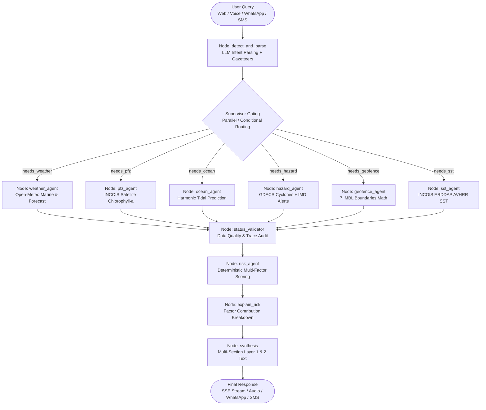

# 🌊 Tarang (तरंग) — Marine Intelligence & Decision-Support Platform

<div align="center">


[](https://fastapi.tiangolo.com)
[](https://langchain-ai.github.io/langgraph/)
[-black?style=flat-square&logo=next.js&logoColor=white)](https://nextjs.org/)
[](https://www.python.org/)
[](https://www.typescriptlang.org/)
[](https://leafletjs.com/)
[](LICENSE)

**AI-powered, deterministic coastal decision-support, fisheries navigation, live oceanographic visualization, and marine ecosystem analytics platform for India's 7,516 km coastline.**

*Empowering artisanal fishermen and marine scientists alike with real-time animated wind streamlets, satellite fishing zones (PFZ), 7 multinational maritime boundary breach alerts (IMBL), tidal predictions, deterministic safe route planning, multilingual voice assistance across 9 Indian coastal languages, and longitudinal bio-oceanographic analytics.*

</div>

---

## 📑 Table of Contents

- [Overview & The Problem We Solve](#-overview--the-problem-we-solve)
- [Key Features & Capabilities](#-key-features--capabilities)
- [Live Marine Weather & Oceanographic Layers](#-live-marine-weather--oceanographic-layers)
- [All 7 International Maritime Boundaries (IMBL)](#-all-7-international-maritime-boundaries-imbl)
- [Safe Marine Route Optimization Engine](#-safe-marine-route-optimization-engine)
- [Ecosystem Productivity & Researcher Suite](#-ecosystem-productivity--researcher-suite)
- [System Architecture & Agent Topology](#-system-architecture--agent-topology)
- [Specialist Agents & Nodes](#-specialist-agents--nodes)
- [Compound Multi-Intent Query Processing](#-compound-multi-intent-query-processing)
- [Multilingual Coastal Engine & Speech](#-multilingual-coastal-engine--speech)
- [Data Sources, Models & Provenance](#-data-sources-models--provenance)
- [API Reference](#-api-reference)
- [Project Directory Structure](#-project-directory-structure)
- [Getting Started & Local Setup](#-getting-started--local-setup)
- [Environment Configuration](#-environment-configuration)
- [Testing & Validation](#-testing--validation)
- [Safety & Ethical Principles](#-safety--ethical-principles)

---

## 🎯 Overview & The Problem We Solve

Over **4 million artisanal and small-scale fishermen** across India's coastline venture into the sea daily in non-motorized and motorized craft under 20 meters. At the same time, marine researchers and policymakers struggle to synthesize fragmented oceanographic data to explain climate-induced fish stock declines. They face five life-threatening and livelihood-critical challenges:

1. **Complex, Inaccessible Weather Warnings**: Bulletins from INCOIS, IMD, and international agencies are dense, PDF-bound, English-heavy, and full of oceanographic jargon unintelligible to traditional fishermen.
2. **Accidental Maritime Border Crossing (IMBL)**: In narrow channels like the Palk Strait, Sir Creek, and the Bay of Bengal, small fishing boats inadvertently drift across the International Maritime Boundary Line (IMBL), leading to boat seizures, prolonged detentions, and diplomatic friction.
3. **Wasted Fuel Searching for Fish**: Traditional fishers rely on generational intuition to locate fishing grounds. Without spatial guidance for Potential Fishing Zones (PFZ), boats consume scarce kerosene and diesel fruitlessly.
4. **Dangerous Marine Navigation**: Existing navigation tools are designed for cars or commercial container ships. Small craft lack marine route planning that accounts for departure times, wave heights, weather corridors, shallow bathymetry, and land avoidance.
5. **Ecosystem & Catch Collapse Disconnect**: Fishery scientists lack unified analytical tools to cross-correlate satellite primary production (Chlorophyll-a), Marine Heatwaves (SST anomalies), and CMFRI fish landing drops to diagnose why fish productivity has declined in key regional fisheries.

### The Tarang Solution

Tarang bridges this gap by combining **real-time satellite observation**, **live animated canvas flow fields**, **geospatial polygon constraint engines**, **multi-agent LangGraph orchestration**, and **longitudinal bio-oceanographic analytics**. It reasons deterministically over physical conditions and delivers life-saving answers in **9 Indian coastal languages** through Web, WhatsApp, SMS, and Voice, while providing researchers with an empirical climate-fisheries diagnostic suite.

---

## ✨ Key Features & Capabilities

```
┌────────────────────────────────────────────────────────────────────────────────────────┐
│                                   TARANG PLATFORM                                      │
├──────────────────────────┬─────────────────────────────┬───────────────────────────────┤
│   ARTISANAL FISHERMEN    │     NAVIGATION & SAFETY     │     RESEARCHERS & ECOLOGY     │
├──────────────────────────┼─────────────────────────────┼───────────────────────────────┤
│ • Animated Wind Particles│ • A* Marine Pathfinding     │ • 84-Month Longitudinal Study │
│ • Plain-English Advisory │ • Shapely Land Avoidance    │ • Trophic Coupling ($r_{chl}$)│
│ • PFZ Satellite Hotspots │ • 7 UNCLOS Border Swaths    │ • Marine Heatwave Attribution │
│ • 9 Coastal Languages    │ • Geofence Breach Reverse   │ • AI Bio-Oceanographer Fellow │
│ • Voice Audio Synthesis  │ • Fail-Closed Safety Scoring│ • Regional Fisheries Diagnosis│
└──────────────────────────┴─────────────────────────────┴───────────────────────────────┘
```

1. **Live Marine Weather Map & Particle Streamlines**: Animated wind vector particle flow with dynamic Beaufort scale color mapping and single-click plain-language advisory cards.
2. **Scalar Marine Ocean Fields**: Interactive coastal heatmaps for Air Temperature ($2\text{m}$), Sea Surface Temperature (SST), and Chlorophyll-a concentration with strict coastal landmasking.
3. **7 Multinational Maritime Boundaries (IMBL)**: Visual demarcation of UNCLOS treaty borders for Sri Lanka, Pakistan, Bangladesh, Maldives, Myanmar, Indonesia, and Thailand with $5\text{ km}$ buffer warning zones.
4. **Potential Fishing Zone (PFZ) Satellite Hotspots**: Viewport-synchronized ocean beacons providing target species (Sardine, Mackerel, Tuna, Anchovy), water depth, and bio-optical chlorophyll concentrations.
5. **Deterministic A\* Marine Route Planning**: Sub-second water-grid pathfinding with land avoidance, dynamic departure offsets, and PFZ corridor attraction bonuses.
6. **Autonomous Multi-Agent LangGraph Supervisor**: Compound multi-intent parsing delivering cross-domain answers across weather, tides, fishing zones, hazards, and borders.
7. **Multilingual Speech & WhatsApp Dispatch**: Bi-directional audio and text support across 9 coastal languages (Hindi, Tamil, Gujarati, Bengali, Telugu, Malayalam, Marathi, Odia, English) with automated emergency SMS/WhatsApp dispatch.
8. **Researcher Suite & Longitudinal Diagnostics**: 84-month empirical analytics (2018–2024) correlating satellite Chlorophyll-a, SST anomalies, and ICAR-CMFRI fish landings across 5 coastal bio-zones.

---

## 🌊 Live Marine Weather & Oceanographic Layers

Tarang features a custom Leaflet Canvas rendering engine built specifically for seafaring conditions and intuitive interpretation by artisanal fishers.

```
                      ┌────────────────────────────────────────┐
                      │          Leaflet Map Canvas            │
                      ├───────────────────┬────────────────────┤
                      │  Wind Particles   │   Scalar Heatmap   │
                      │  (160 Particles)  │  (IDW Interp Grid) │
                      └─────────┬─────────┴──────────┬─────────┘
                                │                    │
                        ┌───────▼────────────────────▼────────┐
                        │   Coastline Landmasking Filter      │
                        │   isPeninsularLandPoint (Front)     │
                        │   is_offshore_marine_point (Back)   │
                        └─────────────────┬───────────────────┘
                                          │
                        ┌─────────────────▼───────────────────┐
                        │    Strict Ocean-Only Visualization  │
                        │    (No inland color bleed / PFZ)    │
                        └─────────────────────────────────────┘
```

### 1. Wind Flow Particle Streamlines (`WindLayer.tsx`)
- **Particle Dynamics**: 160 continuous particle streamlines (70 on mobile) animated at $60\text{ fps}$ via requestAnimationFrame.
- **Physics-Informed Color Scale**:
  - 🟢 **$< 15\text{ km/h}$ (Light / Gentle)**: Safe for all small motorized and traditional craft.
  - 🟡 **$16\text{--}28\text{ km/h}$ (Moderate)**: Caution advised for small non-motorized boats.
  - 🟠 **$29\text{--}42\text{ km/h}$ (Fresh / Strong)**: Rough sea state; small craft should stay inshore.
  - 🔴 **$> 42\text{ km/h}$ (Gale / Storm)**: Extreme danger; immediate return to port.
- **Click-to-Query Marine Advisory Card**: Clicking anywhere on the ocean generates an instant plain-language breakdown including Wind Speed (km/h & Knots), Beaufort Wind Force, Cardinal Drift, expected Sea State, and artisanal safety guidance.

### 2. Scalar Oceanographic Heatmaps (`MarineScalarLayer.tsx`)
- **Air Temperature ($2\text{m}$ Coastal Heat Index)**: Real-time atmospheric temperature field coupled with fish preservation advisories (e.g. mandatory $1:1$ ice-to-fish ratios in water temperatures $> 30^\circ\text{C}$).
- **Sea Surface Temperature (SST)**: High-resolution thermal surface layer derived from satellite ocean models, highlighting coastal upwelling margins and thermal frontal boundaries.
- **Chlorophyll-a Concentration**: Satellite ocean color proxy modeling phytoplankton density ($1.5\text{--}3.2\text{ mg/m}^3$ in nutrient-rich coastal upwelling vs. $0.2\text{--}0.7\text{ mg/m}^3$ in open oligotrophic waters).

### 3. Coastal Landmasking Engine
Spatial interpolation (IDW) naturally bleeds across rectangular bounding boxes. Tarang implements a multi-tier **Coastline Landmask**:
- Points located on peninsular India or Sri Lankan inland terrain are excluded from scalar color rendering.
- Clicking on dry land triggers an explicit disclaimer: *"This layer models open-sea oceanographic conditions and is not applicable inland."*

---

## 🛡️ All 7 International Maritime Boundaries (IMBL)

Accidental border crossing is one of the most perilous risks faced by Indian fishermen. Tarang incorporates **all 7 recognized international maritime boundaries** of the Republic of India under UNCLOS treaties:

| Neighbor Country | Sector / Waterway | Demarcation Treaty / Reference | Fishery Safety Context |
| :--- | :--- | :--- | :--- |
| **🇱🇰 Sri Lanka** | Palk Strait, Palk Bay & Gulf of Mannar | **1974 & 1976 UNCLOS Bilateral Agreements** | High-conflict corridor for Tamil Nadu fishers; strict crossing ban. |
| **🇵🇰 Pakistan** | Sir Creek / Kutch Arabian Sea | **UNCLOS / Notional Maritime Boundary (NMBL)** | Prevents Gujarat trawlers (Okha, Porbandar, Veraval) from PMSA detention. |
| **🇧🇩 Bangladesh** | Sundarbans / Northern Bay of Bengal | **2014 UN PCA ITLOS Delimitation Award** | Permanent Court of Arbitration line for West Bengal & Odisha fishers. |
| **🇲🇻 Maldives** | Eight Degree Channel / Laccadive Sea | **1976 Maritime Boundary Agreement** | Separates Minicoy (Lakshadweep) from Ihavandhippolhu Atoll (Maldives). |
| **🇲🇲 Myanmar** | Coco Channel / Preparis Channel | **1986 Maritime Delimitation Agreement** | Demarcated border north of Landfall Island (North Andaman). |
| **🇮🇩 Indonesia** | Great Channel / Six Degree Channel | **1974 & 1977 Continental Shelf Agreements** | Separates Indira Point (Great Nicobar) from Rondo Island (Aceh/Sumatra). |
| **🇹🇭 Thailand** | Central Andaman Sea / Phuket Basin | **1978 Seabed Boundary Agreement** | Continental shelf seabed boundary with Andaman & Nicobar EEZ. |

### Visual Demarcation & Geofencing Math
- **$5\text{ km}$ Safety Swath**: A semi-transparent crimson buffer polygon ($18\text{px}$ width) highlights the critical buffer zone.
- **Treaty Polylines**: High-contrast red dashed lines with interactive popups detailing the bilateral agreement, sector name, and safe clearance rules.
- **Deterministic Return Heading**: When a vessel approaches within $15\text{ km}$, `boundary_geo.py` computes the exact reverse compass heading (`safe_bearing_deg`) to guide the vessel back into safe Indian territorial waters.

---

## ⚓ Safe Marine Route Optimization Engine

The Tarang Route Optimizer ([`route_planner.py`](backend/tools/route_planner.py)) solves coastal navigation for small craft without relying on generative LLM path assumptions:

```
[Start Coordinates] ──► [Land Mask Filter] ──► [A* Water Graph Search] ──► [Dynamic Arrival Offsets] ──► [Safe Route Output]
         ▲                     ▲                          ▲                          ▲
         │                     │                          │                          │
[End Coordinates]    [india_landmass.geojson]     [IMBL Constraint Buffer]    [Weather & PFZ Corridor Sampling]
```

### Key Technical Pillars
1. **Shapely Prepared Land Polygon (`land_mask.py`)**:
   - Ingests `india_landmass.geojson`, a validated polygon covering the Indian subcontinent and islands.
   - Evaluates point coordinates in $< 1\text{ ms}$ using prepared geometry binary predicates.
   - Automatically drops any candidate waypoint that intersects mainland, islands, or sandbanks.
2. **Hard Safety Constraints**:
   - Nodes within 5 km of any of the 7 IMBL boundaries are strictly pruned from graph expansion.
   - Any route leg encountering wave heights $\ge 4.0\text{ m}$ or wind $\ge 90\text{ km/h}$ is severed.
3. **Dynamic Arrival Time Offsets**:
   - Rather than assuming static conditions, Tarang samples forecast weather along each route leg at the exact future hour the vessel will arrive.
4. **Potential Fishing Zone Attraction**:
   - Cost function:
     $$\text{Cost}(u, v) = \text{Distance}(u, v) + (w_{\text{risk}} \times \text{RiskScore}) - (w_{\text{pfz}} \times \text{ChlorophyllBonus})$$
   - Steers vessels safely closer to productive feeding zones when enabled.

---

## 🐟 Ecosystem Productivity & Researcher Suite

The **Researcher Suite** (`/analytics`) bridges ocean observation with fisheries biology, allowing marine ecologists and policymakers to analyze why fish productivity drops in Indian coastal ecosystems.

### The 5 Coastal Bio-Oceanographic Zones

| Region | Primary Species | Key Environmental Driver | Historical Stress Episodes |
| :--- | :--- | :--- | :--- |
| **🌴 Malabar Coast** (Kerala) | Oil Sardine, Indian Mackerel, Anchovies | Southwest monsoon upwelling timing & post-monsoon SST warming | 2019–2020 Sardine collapse; 2023–2024 El Niño heating |
| **🌊 Gulf of Mannar** (Tamil Nadu) | Blue Swimming Crab, Squid, Seerfish | High shallow SST anomalies, coral bleaching & thermal stratification | 2020 & 2024 Marine Heatwaves (MHWs) |
| **⚓ Saurashtra Coast** (Gujarat) | Ribbonfish, Bombay Duck, Croaker, Pomfret | Winter cooling shifts, continental shelf trawl intensity | 2021 Cyclone Tauktae disruption; 2023 warming |
| **🚢 Konkan Coast** (Maharashtra/Goa) | Mackerel, Penaeid Prawns, Kingfish | Central Arabian Sea upwelling pulses & juvenile harvest pressure | 2019 monsoon delay; 2023 cyclonic disruption |
| **🌀 Coromandel Coast** (TN / AP) | Pelagic Tunas, Anchovies, Silverbellies | Western Bay of Bengal cyclonic storms & Northeast monsoon eddies | 2020 Cyclone Nivar; 2023 post-monsoon deficit |

### Statistical & Oceanographic Mechanics
1. **Trophic Coupling Correlation ($r_{\text{chl, catch}}$)**: Measures Pearson correlation between monthly satellite Chlorophyll-a ($\text{mg/m}^3$) and CMFRI reported landing volumes (tonnes). Values $r > 0.40$ ($p < 0.001$) confirm strong bottom-up primary production dependency.
2. **Thermal Stress Impact ($r_{\text{sst\_anom, catch}}$)**: Quantifies the displacement of pelagic shoals into deeper cooler strata during positive sea surface temperature anomalies.
3. **Marine Heatwave (MHW) Scoring**: Identifies months where SST exceeds $+1.5^\circ\text{C}$ above 30-year climatological baselines.
4. **Primary Productivity Deficits**: Flags ecological stress when Chlorophyll anomalies drop below $Z \le -1.5$.

---

## 🏗️ System Architecture & Agent Topology

Tarang is structured around an event-driven, deterministic **LangGraph StateGraph** orchestrated by FastAPI.



---

## 🤖 Specialist Agents & Nodes

| Agent / Node | Source File | Capability | Primary Source | Execution Trigger |
|---|---|---|---|---|
| **`detect_and_parse`** | [`detect_and_parse.py`](backend/graph/nodes/detect_and_parse.py) | Language detection (9 languages), multi-intent extraction, gazetteer coordinate resolution | Groq `gpt-oss-20b`, Coastal Gazetteer, OSM Nominatim | Always (Initial Gate) |
| **`weather_agent`** | [`weather_agent.py`](backend/graph/nodes/weather_agent.py) | Significant wave height ($H_s$), wave direction, wind speed, wind gusts, atmospheric pressure | Open-Meteo Marine & Atmosphere | `needs_weather == True` |
| **`pfz_agent`** | [`pfz_agent.py`](backend/graph/nodes/pfz_agent.py) | Potential Fishing Zones extracted from chlorophyll-a gradients, zone distance (km), bearing | INCOIS Oceansat-2 (ERDDAP) | `needs_pfz == True` |
| **`ocean_agent`** | [`ocean_agent.py`](backend/graph/nodes/ocean_agent.py) | Harmonic tidal prediction, water level above Chart Datum (m), tidal phase (Flood/Ebb) | INCOIS Tide Model / Survey of India | `needs_ocean == True` |
| **`hazard_agent`** | [`hazard_agent.py`](backend/graph/nodes/hazard_agent.py) | Tropical cyclone tracking within 500 km, wind gust warnings, squall alerts | GDACS, Open-Meteo Alerts, IMD Bulletins | `needs_hazard == True` |
| **`geofence_agent`** | [`geofence_agent.py`](backend/graph/nodes/geofence_agent.py) | Distance to 7 UNCLOS maritime boundaries, foreign water penetration, emergency return bearing | UNCLOS Treaty Boundary Geometries | `needs_geofence == True` |
| **`sst_agent`** | [`sst_agent.py`](backend/graph/nodes/sst_agent.py) | Sea Surface Temperature (SST in °C) and thermal anomaly relative to baseline | NOAA AVHRR/AMSR on INCOIS ERDDAP | `needs_sst == True` |
| **`risk_agent`** | [`risk_agent.py`](backend/graph/nodes/risk_agent.py) | Deterministic mathematical composite risk scoring ($0\text{--}100$), safety thresholds | Specialist agent outputs | `needs_risk == True` |
| **`explain_risk`** | [`explain_risk.py`](backend/graph/nodes/explain_risk.py) | Detailed factor contribution points, percentage weights, and natural language explanation | Risk agent state | `query_type == "risk_explanation"` |
| **`status_validator`**| [`build_graph.py`](backend/graph/build_graph.py) | Evaluates execution status (`success`, `partial`, `failed`) and data freshness | All agent traces | Always |
| **`synthesis`** | [`synthesis.py`](backend/graph/nodes/synthesis.py) | Two-layer output generation: Layer 1 (conversational natural text) and Layer 2 (structured evidence cards) | Groq `gpt-oss-120b` + Intent Template Fallback | Always (Terminal Gate) |
| **`ecosystem_analytics`** | [`ecosystem_analytics.py`](backend/tools/ecosystem_analytics.py) | Longitudinal time series synthesis, trophic correlation, MHW scoring, and researcher LLM chat | MODIS-Aqua, NOAA OISST, ICAR-CMFRI | On `/analytics/*` requests |

---

## 🧩 Compound Multi-Intent Query Processing

Traditional chatbots fail when fishermen combine several questions into one sentence. Tarang solves this through a dual-stage pipeline:

1. **LLM Capability Extraction ([`detect_and_parse.py`](backend/graph/nodes/detect_and_parse.py))**:
   The Groq JSON parser extracts an independent boolean matrix without mutual exclusion:
   ```json
   {
     "is_multi_intent": true,
     "needs_weather": true,
     "needs_ocean": true,
     "needs_pfz": true,
     "needs_hazard": true,
     "needs_risk": false,
     "location_name": "Apollo Bandar"
   }
   ```
2. **Multi-Section Blended Synthesis ([`synthesis.py`](backend/graph/nodes/synthesis.py))**:
   Evaluates all executed agents and constructs a composite answer structured by topic:
   ```markdown
   Here is the assessment for Apollo Bandar covering your requested queries:

   🌊 Water Level & Tide: Water level is about 3.27 m above chart datum (Falling Ebb Tide; Next High Tide at 01:16 PM, 4.4 m).
   🌤 Weather & Wind: Wind: 8.3 km/h (W), Wave height: 0.95 m, Sea: slight.
   🐟 Fishing Potential Indicator (PFZ): Nearest indicator zone is about 106 km away (5 zones detected; satellite proxy).
   ⚠️ Hazard Advisories: Active warnings: rough_sea_advisory, thunderstorm (Hazard Level: MODERATE).
   ```

---

## 🌐 Multilingual Coastal Engine & Speech

```
                          ┌──► English (en)
                          ├──► Hindi (hi - हिन्दी)
                          ├──► Tamil (ta - தமிழ்)
                          ├──► Gujarati (gu - ગુજરાતી)
User Audio / Text Query ──┼──► Bengali (bn - বাংলা)
                          ├──► Telugu (te - తెలుగు)
                          ├──► Malayalam (ml - മലയാളം)
                          ├──► Marathi (mr - मराठी)
                          └──► Odia (od - ଓଡ଼ିଆ)
```

1. **Script Identification**: Fingerprints Unicode blocks for Indian scripts to automatically detect user language even when queries are short.
2. **Standardized Maritime Terminology**: Technical terms like *Chart Datum*, *Significant Wave Height*, *Ebb Tide*, and *Chlorophyll Indicator* are translated into everyday idioms used at coastal fishing harbours.
3. **Sarvam AI Voice Synthesis**: Converts synthesized markdown into regional audio streams with high intelligibility in noisy marine environments.

---

## 📡 Data Sources, Models & Provenance

| Stream | Provider / Model | Technical Dataset | Freshness / TTL | Fallback Asset |
|---|---|---|---|---|
| **Marine Weather** | Open-Meteo Marine | ECMWF / GFS Wave Models ($H_s$, period, direction) | 10 minutes | `data/fallback_weather.json` |
| **Wind & Atmosphere** | Open-Meteo Forecast | ERA5 / ICON Wind ($10\text{m}$), pressure, gusts | 10 minutes | `tools/wind_grid.py` (5-min cache) |
| **Sea Surface Temp (SST)**| Open-Meteo Marine | Satellite Thermal Infrared & Microwave SST | 60 minutes | `tools/marine_layers.py` (Ocean baseline) |
| **Chlorophyll-a** | Bio-Optical Coastal Model | INCOIS Oceansat-2 shelf decay baseline ($1.5\text{--}3.2\text{ mg/m}^3$) | Dynamic Grid | `tools/marine_layers.py` |
| **Potential Fishing Zones**| INCOIS Advisory Engine | Satellite Frontal & Thermal Convergence Hotspots | 60 minutes | Viewport-bound offshore generator |
| **Tides & Water Levels** | INCOIS / SOI | Harmonic Tidal Constituents (Chart Datum) | 60 minutes | 8-port harmonic baseline |
| **Tropical Cyclones** | GDACS | Global Disaster Alert & Coordination System | 10 minutes | `data/fallback_hazards.json` |
| **Fisheries Time-Series** | ICAR-CMFRI / NASA / NOAA | 84-month Chlorophyll, SST anomaly, & Catch (2018–2024) | Static Longitudinal | `data/fisheries_productivity_timeseries.json` |
| **7 IMBL Boundaries** | UNCLOS Treaties | High-resolution treaty polylines (7 countries) | Static | `data/imbl_boundary.geojson` |
| **Coastline Landmask** | Natural Earth / GADM | Simplified Indian subcontinent & island polygons | Static | `data/india_landmass.geojson` |

---

## 🔌 API Reference

### 1. `POST /query` (Core Question Answering via SSE)
Streams agent execution statuses, followed by the complete response payload.

**Request Body:**
```json
{
  "query": "What is the sea level and fishing zone near Mumbai?",
  "conversation_id": "session-101",
  "language": "en",
  "selected_location": {
    "name": "Mumbai",
    "lat": 18.9220,
    "lon": 72.8347,
    "coastal": true
  }
}
```

---

### 2. `GET /weather/wind-grid` (Live Wind Vector Field)
Returns gridded wind speed, direction, gusts, and fisherman advisory for the visible bounding box.

**Query Parameters:**
- `lat_min`, `lat_max`, `lon_min`, `lon_max`: Geographic bounds.
- `grid_density`: Optional resolution parameter (`low`, `medium`, `high`).

---

### 3. `GET /weather/marine-layer-grid` (Ocean Scalar Heatmaps)
Returns gridded scalar matrices for Air Temperature, Sea Surface Temperature (SST), or Chlorophyll-a with automatic peninsular landmasking.

**Query Parameters:**
- `layer_type`: `temperature` | `sst` | `chlorophyll`
- `lat_min`, `lat_max`, `lon_min`, `lon_max`: Geographic bounds.

---

### 4. `GET /boundaries/imbl` (All 7 UNCLOS Maritime Boundaries)
Returns GeoJSON FeatureCollection of all 7 bilateral maritime boundary polylines (Sri Lanka, Pakistan, Bangladesh, Maldives, Myanmar, Indonesia, Thailand) with treaty metadata and buffer rules.

---

### 5. `GET /marine/pfz-grid` (Offshore Potential Fishing Zones)
Returns satellite-derived Potential Fishing Zone advisory beacons across the visible open-sea viewport.

---

### 6. `POST /route` (Safe Marine Route Planner)
Calculates an A* optimized marine route avoiding land, severe weather, and maritime boundaries.

**Request Body:**
```json
{
  "start_lat": 13.0827,
  "start_lon": 80.2707,
  "end_lat": 13.4500,
  "end_lon": 80.6000,
  "start_name": "Chennai Harbour",
  "end_name": "Offshore Fishing Ground",
  "departure_utc": "2026-09-20T04:00:00Z",
  "include_pfz": true
}
```

---

### 7. `POST /geofence/evaluate` (Real-Time IMBL Monitor)
Evaluates vessel coordinates against all 7 international maritime borders.

**Request Body:**
```json
{
  "lat": 9.2800,
  "lon": 79.3200,
  "phone": "+919876543210"
}
```

---

### 8. `GET /analytics/productivity` & `POST /analytics/productivity/diagnose`
Retrieves 84-point monthly time-series, Pearson correlation statistics, and automated causal diagnoses for coastal bio-zones.

---

## 📁 Project Directory Structure

```
tarang/
├── backend/
│   ├── main.py                                  # FastAPI entry point & API endpoints
│   ├── config.py                                # Central settings, TTLs, risk weights
│   ├── requirements.txt                         # Python dependencies
│   ├── graph/
│   │   ├── state.py                             # TypedDict state contracts (ORCAState, AgentResult)
│   │   ├── build_graph.py                       # Compiled LangGraph StateGraph & checkpoint wrappers
│   │   └── nodes/
│   │       ├── detect_and_parse.py              # Multi-intent extraction & language detection
│   │       ├── weather_agent.py                 # Marine weather agent
│   │       ├── pfz_agent.py                     # Satellite chlorophyll PFZ finder
│   │       ├── ocean_agent.py                   # Harmonic tidal water-level calculator
│   │       ├── hazard_agent.py                  # GDACS tropical cyclones & weather advisories
│   │       ├── geofence_agent.py                # 7-border proximity monitoring
│   │       ├── sst_agent.py                     # Sea Surface Temperature observation client
│   │       ├── risk_agent.py                    # Deterministic multi-factor safety scoring
│   │       ├── explain_risk.py                  # Factor contribution point breakdown
│   │       └── synthesis.py                     # Multi-section Layer 1 & 2 synthesizer
│   ├── tools/
│   │   ├── wind_grid.py                         # Open-Meteo wind grid fetcher & cache
│   │   ├── marine_layers.py                     # Marine scalar grids & IMBL GeoJSON provider
│   │   ├── ecosystem_analytics.py               # Time-series analytics, correlation & researcher AI
│   │   ├── route_planner.py                     # Deterministic A* marine route optimization
│   │   ├── land_mask.py                         # Shapely prepared polygon land-masking
│   │   ├── boundary_geo.py                      # Geodesic distance & 7-border IMBL geometry math
│   │   ├── incois_client.py                     # INCOIS client
│   │   ├── sms_sender.py                        # Twilio SMS dispatch
│   │   └── whatsapp_sender.py                   # Twilio WhatsApp border breach dispatch
│   ├── location/
│   │   ├── models.py                            # Location Pydantic schemas
│   │   └── service.py                           # 3-tier canonical resolver & offshore validation
│   └── data/
│       ├── fisheries_productivity_timeseries.json # 84-month empirical dataset (Chl-a, SST, Catch)
│       ├── coastal_places.json                  # 116+ coastal fishing harbours
│       ├── india_landmass.geojson               # Subcontinent coastline polygons
│       └── imbl_boundary.geojson                # 7 UNCLOS international maritime boundaries
│
├── frontend/
│   ├── src/
│   │   ├── app/                                 # Next.js App Router
│   │   ├── components/
│   │   │   ├── map/
│   │   │   │   ├── MarineMap.tsx                # Leaflet geospatial container & route view
│   │   │   │   ├── WindLayer.tsx                # Canvas wind vector particle animation
│   │   │   │   ├── MarineScalarLayer.tsx        # Heatmaps for Temp, SST, Chlorophyll
│   │   │   │   └── MapLayersPanel.tsx           # Floating layer control dock & dynamic legend
│   │   │   ├── research/
│   │   │   │   ├── EcosystemAnalyticsView.tsx   # Interactive SVG time-series & causal diagnosis
│   │   │   │   └── ResearcherChatbot.tsx        # Bio-Oceanographic AI Research Fellow
│   │   │   ├── chat/                            # Query input, audio controls, message bubbles
│   │   │   └── route/                           # RoutePanel.tsx route optimization UI
│   │   └── lib/
│   │       ├── api.ts                           # API client for all backend endpoints
│   │       ├── i18n.ts                          # 9-language translation dictionaries
│   │       └── types.ts                         # TypeScript data models
```

---

## 🚀 Getting Started & Local Setup

### Prerequisites
- **Python**: 3.10, 3.11, or 3.12
- **Node.js**: 18.x, 20.x, or 22.x
- **Git**
- Valid API keys for **Groq** (required for LLM features) and optionally **Sarvam AI** (voice TTS) and **Twilio** (WhatsApp/SMS).

---

### Step 1: Clone the Repository
```bash
git clone https://github.com/Suryansh-singh-137/Tarang.git
cd Tarang
```

---

### Step 2: Backend Setup
```bash
cd backend

# Create & activate virtual environment
python -m venv venv

# Windows:
.\venv\Scripts\activate
# Linux/macOS:
source venv/bin/activate

# Install dependencies
pip install -r requirements.txt

# Configure environment variables
copy .env.example .env   # Windows
cp .env.example .env     # Linux/macOS
```

Open `backend/.env` and insert your credentials. Then start the backend server:
```bash
uvicorn main:app --reload --port 8000
```
Backend will be live at: `http://localhost:8000` (API documentation at `http://localhost:8000/docs`).

---

### Step 3: Frontend Setup
In a separate terminal window:
```bash
cd frontend

# Install Node modules
npm install

# Start Next.js development server
npm run dev
```
Frontend will be live at: `http://localhost:3000`.

---

## ⚙️ Environment Configuration

Set these variables in `backend/.env`:

```env
# ---------------------------------------------------------------------------
# LLM & Voice Providers
# ---------------------------------------------------------------------------
GROQ_API_KEY=gsk_your_groq_api_key_here
GROQ_MODEL_FAST=openai/gpt-oss-20b        # Fast parser model
GROQ_MODEL_QUALITY=openai/gpt-oss-120b    # Quality synthesis & researcher model
SARVAM_API_KEY=your_sarvam_api_key_here    # Multilingual Voice TTS (optional)

# ---------------------------------------------------------------------------
# Twilio WhatsApp & SMS Alerts (Optional)
# ---------------------------------------------------------------------------
TWILIO_ACCOUNT_SID=AC...
TWILIO_AUTH_TOKEN=...
TWILIO_WHATSAPP_NUMBER=whatsapp:+14155238886
TWILIO_SMS_NUMBER=+1...
TWILIO_RECIPIENT_PHONE=+91...

# ---------------------------------------------------------------------------
# Cache & Timeout Thresholds
# ---------------------------------------------------------------------------
HTTP_TIMEOUT=10.0
CACHE_TTL_MARINE_S=600                     # 10 minutes
CACHE_TTL_PFZ_S=3600                       # 60 minutes
FOLLOWUP_CACHE_TTL_SECONDS=300             # 5 minutes
MAX_CONVERSATION_TURNS=6
GEOFENCE_WHATSAPP_COOLDOWN_SECONDS=300

# ---------------------------------------------------------------------------
# Deterministic Risk Weights (Must sum to 1.0)
# ---------------------------------------------------------------------------
RISK_WEIGHT_WAVE=0.30
RISK_WEIGHT_WIND=0.20
RISK_WEIGHT_HAZARD=0.30
RISK_WEIGHT_BOUNDARY=0.20

# ---------------------------------------------------------------------------
# Route Optimizer Settings
# ---------------------------------------------------------------------------
ROUTE_GRID_SPACING_DEG=0.08                # ~8.8 km grid resolution
ROUTE_MAX_DISTANCE_KM=500.0                # Cap for artisanal vessels
ROUTE_RISK_WEIGHT=25.0
ROUTE_PFZ_BONUS=15.0
ROUTE_ASSUMED_SPEED_KMH=15.0               # Typical small fishing craft
```

---

## 🧪 Testing & Validation

Tarang includes dedicated verification suites:

### 1. Test Maritime Geofence Breach on All Borders
```bash
cd backend
python tests/test_geofence_breach.py
```

### 2. Test Ecosystem Analytics & Researcher Engine
```bash
cd backend
python -c "from tools.ecosystem_analytics import diagnose_productivity_decline; res = diagnose_productivity_decline('malabar'); print('Status:', res['ecological_status'], 'Causes:', len(res['primary_causes']))"
```

### 3. Test Safe Marine Route Optimizer
```bash
cd backend
python -c "from tools.route_planner import plan_safe_route; r = plan_safe_route(13.0827, 80.2707, 13.5, 80.8, 'Chennai', 'Offshore'); print('Status:', r['status'], 'Distance:', r.get('total_distance_km'))"
```

### 4. TypeScript Validation
```bash
cd frontend
npx tsc --noEmit
```

---

## ⚖️ Safety & Ethical Principles

1. **Decision-Support, Not Departure Clearance**: Tarang acts as an advisory navigational tool. It **never authorizes departure** and always reminds fishers to follow official advisories from IMD, INCOIS, and the Indian Coast Guard.
2. **Fail-Closed Guarantee**: When critical safety sensors or live feeds are unreachable, Tarang refuses to issue a false "Safe" rating. It defaults to `UNKNOWN` risk with caution.
3. **No Hallucinated Data**: Oceanographic figures (wave heights, water levels, wind speeds, catch figures) strictly originate from verified data traces. If data is absent, Tarang reports it as unavailable.
4. **Chlorophyll Disclaimers**: Satellite chlorophyll-a indicators are presented as potential indicators of fish presence, never as a commercial fish catch guarantee.
5. **Border Respect**: Sovereign international borders are treated as inviolable boundaries to safeguard fishermen from international maritime friction.

---

<div align="center">

**Tarang (तरंग)** — *Built with precision, data, and purpose for the seafaring communities and marine scientists of India.*

</div>
